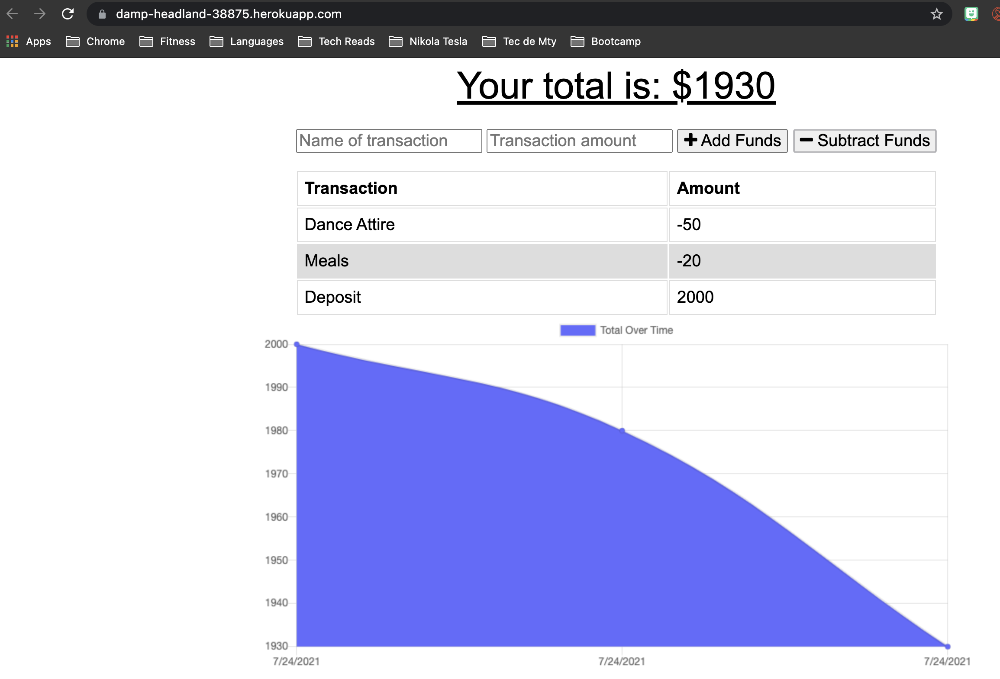

# Budget tracker

## Description
The user as a traveler, can track withdrawals and deposits with or without a data/internet connection, so that the account balance is accurate while traveling.

## Features and functionality
This app allows the user to add expenses and deposits to their budget with, or without a connection.

The user can interact with the app online and offline:

1) Offline Functionality:
   * Enter deposits offline
   * Enter expenses offline


2) When brought back online:
   * Offline entries are added to tracker
 
## Acceptance Criteria
```
GIVEN a user is on Budget App without an internet connection
WHEN the user inputs a withdrawal or deposit
THEN that will be shown on the page, and added to their transaction history when their connection is back online.
```

## Mockup Image




## Resources

indexedDB
javascript
express
html
css

## Links to repository and application

### Heroku
[Heroku App](https://damp-headland-38875.herokuapp.com/)

### Git Repo
[GitHub Repo](https://github.com/adina-hc/budget-trackers)
